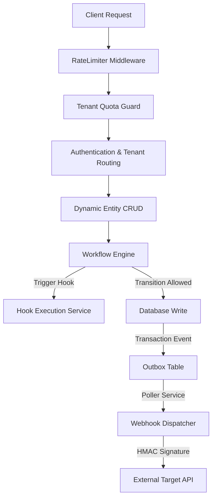
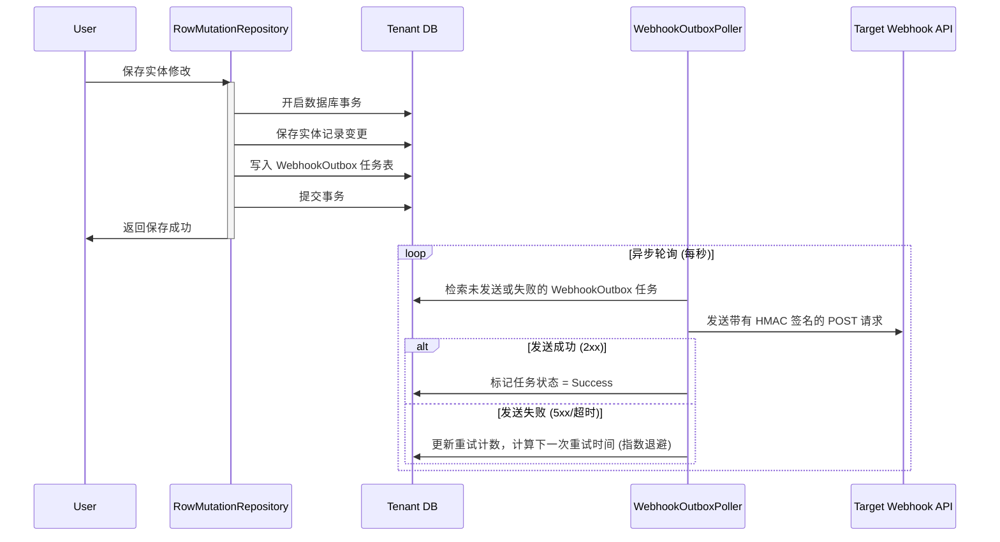

# NetYamlForge 框架底层增强机制详细设计书
## (工作流引擎、API 速率限制、外发 Webhooks 及多租户配额控制)

本设计书旨在解决 **NetYamlForge** 框架在复杂业务流程控制、系统安全流量防护、外部异构系统集成以及多租户资源边界限制等维度的核心不足，提出了一套基于元数据驱动（YAML）、可插拔且高可用的底层增强方案。

---

## 🛠️ 整体架构增强拓扑



---

## 1. 声明式工作流与状态机引擎 (Declarative Workflow & State Machine Engine)

### 1.1 现有缺陷分析
目前框架中仅包含 [WorkflowGuideService.cs](file:///home/ubuntu/ws/NetYamlForge/NetYamlForge/Services/WorkflowGuideService.cs)，其基于静态步骤定义，仅用于前端向导式 UI 的导航，不具备后端强约束的状态控制。实体数据（如订单、审批单）无法在数据库层和 API 层受到安全的状态机约束，容易发生状态非法流转和越权操作。

### 1.2 升级设计方案

#### A. 实体工作流元数据配置规范
在实体 YAML（例如 `customer_order.yaml`）中支持声明 `workflow` 节点：

```yaml
entity: customer_order
table_name: customer_orders
workflow:
  enabled: true
  state_field: status         # 记录状态的字段，默认为 status
  initial_state: Draft
  states:
    - name: Draft
      label: "草稿"
    - name: PendingApproval
      label: "待审批"
    - name: Approved
      label: "已通过"
    - name: Rejected
      label: "已驳回"
  
  transitions:
    - name: submit
      label: "提交审批"
      from: ["Draft"]
      to: PendingApproval
      roles: ["User", "Manager"] # 仅允许的角色
      guards:
        - type: script
          script_path: "guards/check_order_amount.cs" # Roslyn 脚本控制流转门槛
      actions:
        - type: notification
          template: "OrderSubmitted"
          
    - name: approve
      label: "通过审批"
      from: ["PendingApproval"]
      to: Approved
      roles: ["Manager", "Admin"]
      actions:
        - type: hook
          name: "OnOrderApproved" # 触发 HookExecutionService 中的挂载钩子
          
    - name: reject
      label: "驳回审批"
      from: ["PendingApproval"]
      to: Rejected
      roles: ["Manager", "Admin"]
```

#### B. C# 核心接口设计

设计 `IWorkflowEngine` 接口及 `WorkflowTransitionResult` 响应实体，放置于新建的 [Services/Workflow](file:///home/ubuntu/ws/NetYamlForge/NetYamlForge/Services/Workflow) 目录下：

```csharp
namespace NetYamlForge.Services.Workflow;

public interface IWorkflowEngine
{
    Task<WorkflowTransitionResult> CanTransitionAsync(
        string entityName, 
        string recordId, 
        string actionName, 
        Dictionary<string, object> context);

    Task<WorkflowTransitionResult> TriggerTransitionAsync(
        string entityName, 
        string recordId, 
        string actionName, 
        Dictionary<string, object> context);
}

public class WorkflowTransitionResult
{
    public bool Success { get; set; }
    public string? ErrorMessage { get; set; }
    public string? FromState { get; set; }
    public string? ToState { get; set; }
}
```

#### C. 数据写入与生命周期拦截集成
在 [RowMutationRepository.cs](file:///home/ubuntu/ws/NetYamlForge/NetYamlForge/Services/RowMutationRepository.cs) 或通用的 `Update` 服务端点中，增加状态机检查机制：
1. 检查修改目标是否已启用状态机控制。
2. 若用户试图改变状态字段的值，或通过特定 `/api/workflow/{entity}/{id}/transition` 端点请求流转，必须调用 `IWorkflowEngine.TriggerTransitionAsync`。
3. 执行状态机规则：校验当前状态是否属于 `from` 状态集，校验当前用户角色权限，编译并运行 `guards` 动态脚本。
4. 状态流转成功后，自动将状态转换历史写入 `WorkflowHistory` 审计表，并执行流转关联 of `actions`（包含外发事件与 Hook 触发）。

---

## 2. 声明式 API 速率限制与节流 (Declarative API Rate Limiting & Throttling)

### 2.1 现有缺陷分析
由元数据动态生成的端点（`/api/entities/{entity}`）缺乏流量保护机制。任何恶意的或者编写不当的客户端脚本，都可以通过极高的并发频率刷写接口，引发整个系统的物理数据库连接池耗尽、CPU 满载，严重影响系统可用性。

### 2.2 升级设计方案

#### A. 声明式限流元数据配置规范
在实体 YAML 或全局配置 `rate_limits.yaml` 中配置限流规则：

```yaml
# 针对特定动态实体接口的限流
entity: customer_profile
rate_limiting:
  enabled: true
  strategy: SlidingWindow  # SlidingWindow, FixedWindow, TokenBucket, Concurrency
  permit_limit: 100        # 允许的最大请求数
  window_seconds: 60       # 窗口时间（秒）
  queue_limit: 10          # 排队上限
  limit_by: IP             # IP, User, Tenant (根据上下文限流)
```

#### B. C# 核心限流中间件设计
利用 .NET Core 原生的限流框架进行动态加载，或实现自定义的 `DynamicRateLimitingMiddleware`。

```csharp
namespace NetYamlForge.Services.Api;

using System.Threading.RateLimiting;
using Microsoft.AspNetCore.RateLimiting;

public class DynamicRateLimiterPolicyProvider : IRateLimiterPolicy<string>
{
    private readonly IEntityMetadataProvider _metadataProvider; // 获取元数据配置
    private readonly ITenantContextAccessor _tenantAccessor;

    public RateLimitPartition<string> GetPartition(HttpContext httpContext)
    {
        // 1. 获取当前路由中的 EntityName
        var entityName = httpContext.Request.RouteValues["entity"]?.ToString();
        if (string.IsNullOrEmpty(entityName))
        {
            return RateLimitPartition.GetNoLimiter("Default");
        }

        // 2. 加载元数据并解析限流规则
        var config = _metadataProvider.GetEntityConfig(entityName);
        if (config?.RateLimiting?.Enabled != true)
        {
            return RateLimitPartition.GetNoLimiter("Default");
        }

        // 3. 构造限流隔离分区健 (Partition Key)
        string partitionKey = BuildPartitionKey(httpContext, config.RateLimiting.LimitBy, entityName);

        // 4. 返回对应的限流策略分区
        return RateLimitPartition.GetSlidingWindowLimiter(partitionKey, _ => new SlidingWindowRateLimiterOptions
        {
            PermitLimit = config.RateLimiting.PermitLimit,
            Window = TimeSpan.FromSeconds(config.RateLimiting.WindowSeconds),
            QueueLimit = config.RateLimiting.QueueLimit,
            SegmentsPerWindow = 6
        });
    }
}
```

#### C. 数据存储与分布式扩展
* **单机版**：使用 `MemoryCache` 或 `System.Threading.RateLimiting` 底层计数器提供高速过滤。
* **分布式/集群版**：在 `Connection` 服务模块中引入 Redis，封装 `RedisRateLimiter` 替换内存计数器，确保多实例部署下的限流准确性。
* **响应规范**：当请求超出限制时，中间件返回 `429 Too Many Requests` 状态码，并在 Header 中附带 `Retry-After: {seconds}`。

---

## 3. 事务性外发 Webhooks 与事件推送 (Outbound Webhooks & Transactional Event Bus)

### 3.1 现有缺陷分析
虽然系统内有 [OutboxJobBackgroundService.cs](file:///home/ubuntu/ws/NetYamlForge/NetYamlForge/Services/BatchJob/OutboxJobBackgroundService.cs)，但仅用于系统内部后台批处理任务的排程。框架没有通用的外发事件通知设计，无法向租户或外部第三方应用（如微信、企业微信或客户 CRM）即时推送实体变更或工作流审批事件。

### 3.2 升级设计方案

#### A. Webhook YAML 订阅配置规范
在项目中引入 `webhooks.yaml` 供开发/租户声明外部集成：

```yaml
webhooks:
  - name: sync_crm_customer
    enabled: true
    events: 
      - "entity.customer_profile.created"
      - "entity.customer_profile.updated"
    target_url: "https://api.crm.corp/webhooks/listener"
    secret: "whsec_super_secure_key_123" # 用于 HMAC-SHA256 签名校验
    max_retry_attempts: 5
    initial_delay_seconds: 5
```

#### B. C# 事务性本地发件箱 (Outbox) 模式结合
为了防止因网络波动、接收端崩溃导致事件丢失，或者数据库事务回滚导致的脏数据发送，Webhooks 必须满足 **Transactional Outbox 模式**。



#### C. 安全签名与负载保障
* **签名算法**：在发送 Webhook 消息时，在 HTTP 头中加入 `X-NetYamlForge-Signature`。其内容为：`t={timestamp},v1={HMAC-SHA256(timestamp + "." + jsonPayload, secret)}`。客户端通过相同的算法与 `secret` 对包体进行验签，有效防止重放攻击和数据篡改。
* **重试避让**：如果发送失败，重试时间按照 $T = InitialDelay \times 2^{Attempt}$ 递增。达到最大重试次数后，任务状态变更为 `Failed`（死信队列），并通过系统通知发送至租户管理员。

---

## 4. 多租户配额与资源限制限制器 (Multi-Tenant Quota & Resource Limiter)

### 4.1 现有缺陷分析
NetYamlForge 已经实现了物理/逻辑租户数据隔离，但对于系统共享资源没有任何“熔断”和配额约束。某些租户可能会因为编写了死循环代码，或者存储了极大容量的实体，导致单库体积无限膨胀，独占系统所有网络带宽和存储盘空间。

### 4.2 升级设计方案

#### A. 租户配额配置结构
在 `tenant.yaml` 中为每个租户定义其最高资源利用上限：

```yaml
tenant_id: "tenant_001"
name: "标准付费版租户"
quotas:
  max_entities_count: 50         # 允许创建的最大动态实体元数据文件数
  max_db_rows_per_entity: 100000 # 每个实体表的最大行数限制（逻辑隔离下有效）
  max_api_requests_per_month: 500000 # 每月 API 调用上限
  max_storage_bytes: 5368709120  # 5GB 存储上限 (附件、临时文件)
```

#### B. C# 核心拦截器与校验器实现

放置于 [Services/Tenant](file:///home/ubuntu/ws/NetYamlForge/NetYamlForge/Services/Tenant) 目录下：

```csharp
namespace NetYamlForge.Services.Tenant;

public interface ITenantQuotaValidator
{
    Task CheckEntityCreationQuotaAsync(string tenantId);
    Task CheckDatabaseRowsQuotaAsync(string tenantId, string tableName);
    Task CheckStorageQuotaAsync(string tenantId, long incomingFileSizeBytes);
}
```

在 [RowMutationRepository.cs](file:///home/ubuntu/ws/NetYamlForge/NetYamlForge/Services/RowMutationRepository.cs) 写入方法和 [FileUploadService.cs](file:///home/ubuntu/ws/NetYamlForge/NetYamlForge/Services/FileUploadService.cs) 保存文件时，强行插入配额规则检查：

```csharp
// 在 InsertAsync 内部：
var tenantId = _tenantContext.CurrentTenantId;
await _quotaValidator.CheckDatabaseRowsQuotaAsync(tenantId, tableName);

// 如果超出配额限制，直接抛出 TenantQuotaExceededException，并在 CommandResult 或 API 返回 403 Forbidden 附带错误码。
```

---

## 📅 实现与重构里程碑 (开发路线图)

| 阶段 | 核心模块 | 改造涉及的关键类/目录 | 预期产出与测试建议 |
|---|---|---|---|
| **Phase 1** | **声明式工作流引擎** | `Services/Workflow/`<br>[RowMutationRepository.cs](file:///home/ubuntu/ws/NetYamlForge/NetYamlForge/Services/RowMutationRepository.cs) | 支持在实体 YAML 配置 `workflow` 规则，实现基于状态转换的角色权限校验与 guard 拦截。<br>**测试建议**：编写单元测试模拟不同角色的订单审批流，验证非法越态转换抛出异常。 |
| **Phase 2** | **API 速率限制与节流** | [DynamicRateLimitingMiddleware.cs](file:///home/ubuntu/ws/NetYamlForge/NetYamlForge/Services/Api/DynamicRateLimitingMiddleware.cs)<br>`DynamicRateLimiterPolicyProvider.cs` | 实现针对不同动态实体、按 IP/用户分区的滑动窗口限流保护。<br>**测试建议**：使用压力测试工具（如 wrk 或 ab）在 1 秒内发送超过限制值的请求，确认返回 429 响应。 |
| **Phase 3** | **事务性外发 Webhooks** | `Services/Webhook/`<br>`WebhookOutboxPoller.cs`<br>[BatchJobHostedService.cs](file:///home/ubuntu/ws/NetYamlForge/NetYamlForge/Services/BatchJob/BatchJobHostedService.cs) | 写入 WebhookOutbox 任务并在后台异步轮询派发，带有 HMAC-SHA256 签名机制与退避重试管道。<br>**测试建议**：模拟接收端返回 500，验证任务重试时间间隔成指数上升；接收端成功后，状态是否为 Success。 |
| **Phase 4** | **多租户配额限制器** | `Services/Tenant/`<br>`TenantQuotaMiddleware.cs`<br>[FileUploadService.cs](file:///home/ubuntu/ws/NetYamlForge/NetYamlForge/Services/FileUploadService.cs) | 实体行数、月度 API 请求上限和文件存储上限的强制限制校验拦截。<br>**测试建议**：向被限制的租户插入超量数据，验证拦截并阻断 SQL 写入，返回 403 限额已满的结构化错误。 |
