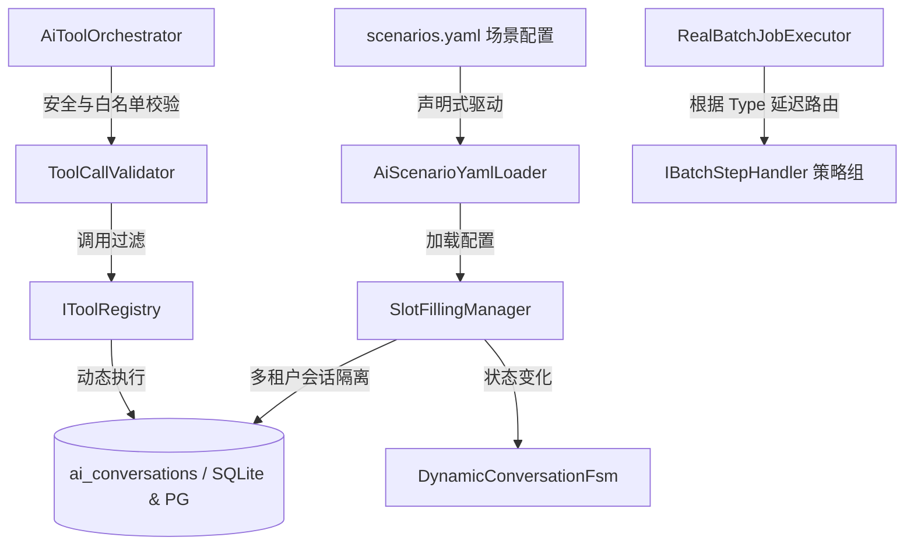
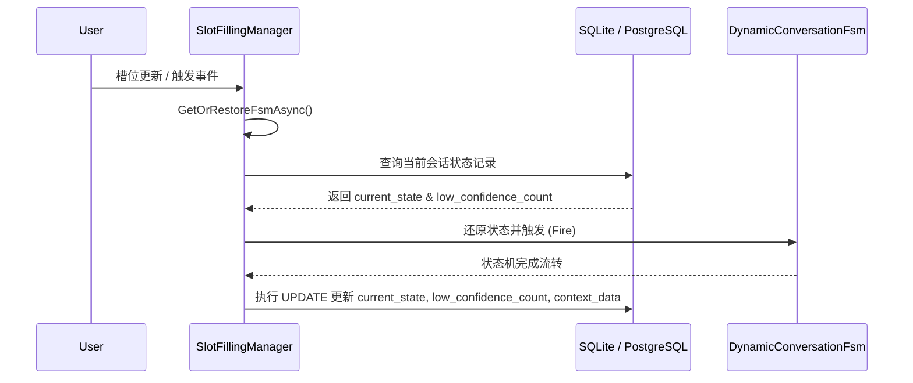
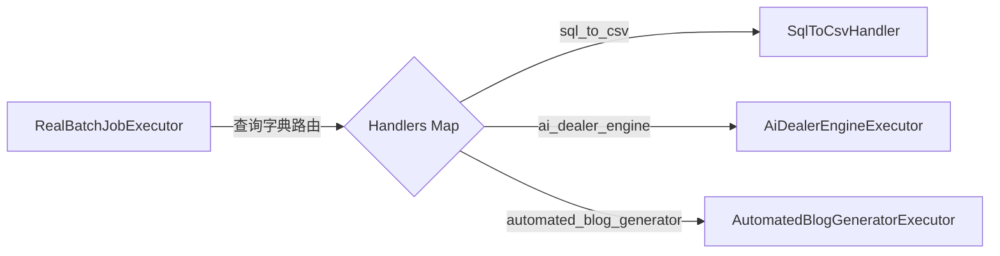
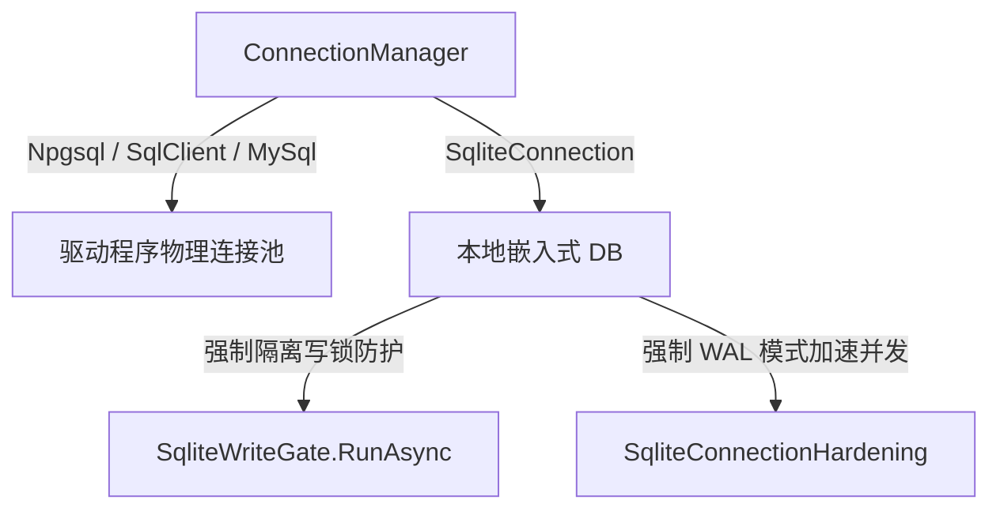

# NetYamlForge AI 时代架构进化详细设计书

本设计书基于对 [NetYamlForge](file:///home/ubuntu/ws/NetYamlForge) 项目现有 AI 交互模块、有限状态机（FSM）管理、批处理任务（BatchJob）引擎和数据库连接层的审计，制定了系统性的重构与进化方案。其核心目标是推动框架向**“AI 可直接驱动的声明式业务后端”**演进。

---

## 1. 架构演进蓝图 (Evolution Blueprint)

在 AI 原生时代，NetYamlForge 必须打破传统的硬编码配置瓶颈，通过声明式机制允许 AI 代理动态接入并安全地操控后端资源。



---

## 2. 声明式 AI 场景与 YAML 驱动配置 (Issue 7 & 4)

### 2.1 设计目的
目前 AI 的槽位收集（Slot-filling）和状态流转规则高度硬编码于 C# 代码中。为实现彻底的“声明式驱动”，必须支持通过 YAML 动态配置槽位、FSM 状态链和 Tool 许可名单。

### 2.2 配置文件设计 (`scenarios.yaml`)
每个租户/项目可在配置目录中定义自己的 AI 场景。
配置文件路径示例：[projects/auto-dealer-demo/ai/scenarios.yaml](file:///home/ubuntu/ws/NetYamlForge/projects/auto-dealer-demo/ai/scenarios.yaml)

```yaml
# AI 场景声明式配置
scenarios:
  test_drive:
    description: "试驾预约场景"
    initial_state: "Init"
    slots:
      required:
        - name: "vehicle_model"
          prompt: "请问您想试驾哪个车型？"
          trigger: "VehicleProvided"
        - name: "preferred_date"
          prompt: "您期望的试驾日期是哪天？"
          trigger: "DateProvided"
        - name: "preferred_time"
          prompt: "您期望在哪个时间段进行试驾？"
          trigger: "TimeProvided"
        - name: "customer_name"
          prompt: "方便告知您的姓名吗？"
          trigger: "NameProvided"
        - name: "customer_phone"
          prompt: "请留下您的联系电话，以便为您确认预约。"
          trigger: "PhoneProvided"
      optional: []
    fsm:
      states:
        - "Init"
        - "CollectVehicle"
        - "CollectDate"
        - "CollectTime"
        - "CollectName"
        - "CollectPhone"
        - "Confirming"
        - "Booked"
        - "Escalate"
      transitions:
        - from: "Init"
          trigger: "VehicleProvided"
          to: "CollectVehicle"
        - from: "CollectVehicle"
          trigger: "DateProvided"
          to: "CollectDate"
        - from: "CollectDate"
          trigger: "TimeProvided"
          to: "CollectTime"
        - from: "CollectTime"
          trigger: "NameProvided"
          to: "CollectName"
        - from: "CollectName"
          trigger: "PhoneProvided"
          to: "Confirming"
        - from: "Confirming"
          trigger: "Confirmed"
          to: "Booked"
        - from: "*"
          trigger: "LowConfidence"
          to: "Escalate"
    tools:
      allowed_by_state:
        Init: ["query_data"]
        CollectVehicle: ["query_data"]
        Confirming: ["create_appointment_request"]
```

### 2.3 配置加载类设计
在 [Services/AI/AiScenarioConfig.cs](file:///home/ubuntu/ws/NetYamlForge/NetYamlForge/Services/AI/AiScenarioConfig.cs) 中定义 POCO，并利用 [Services/AI/AiScenarioYamlLoader.cs](file:///home/ubuntu/ws/NetYamlForge/NetYamlForge/Services/AI/AiScenarioYamlLoader.cs) 实现多租户配置解析与缓存。

```csharp
public class ScenarioConfig
{
    public string Description { get; set; } = string.Empty;
    public string InitialState { get; set; } = "Init";
    public List<SlotConfig> RequiredSlots { get; set; } = new();
    public List<SlotConfig> OptionalSlots { get; set; } = new();
    public FsmConfig Fsm { get; set; } = new();
    public Dictionary<string, List<string>> AllowedToolsByState { get; set; } = new();
}

public class SlotConfig
{
    public string Name { get; set; } = string.Empty;
    public string Prompt { get; set; } = string.Empty;
    public string? Trigger { get; set; }
}
```

> [!NOTE]
> `AiScenarioYamlLoader` 需具备热重载或过期缓存更新机制，以便在租户热更新 YAML 后无感刷新内存中的配置映像。

---

## 3. FSM 多租户持久化与恢复设计 (Issue 1 & 6)

### 3.1 设计目的
防止 FSM 状态机驻留于纯内存引起的重启丢失。要求将会话的当前状态、槽位数值及低置信度计数同步持久化至数据库。

### 3.2 数据库与持久化链路
系统已拥有多租户 `ai_conversations` 物理表。
- **状态同步字段**：`current_state` (存储当前状态机位置，如 `collect_vehicle`)，`low_confidence_count` (低置信度计数)，`context_data` (槽位会话 JSON Payload)。



### 3.3 核心代码重写：FSM 延迟恢复与同步
在 [SlotFillingManager.cs](file:///home/ubuntu/ws/NetYamlForge/NetYamlForge/Services/AI/SlotFillingManager.cs) 中重写状态机恢复逻辑：

```csharp
private async Task<IConversationFsm> GetOrRestoreFsmAsync(string conversationId, string? projectId)
{
    var fsmKey = GetFsmKey(conversationId, projectId);
    if (_fsmStates.TryGetValue(fsmKey, out var existing))
        return existing;

    // 从 DB 物理读回
    var dbState = await WithDbAsync(projectId, async db =>
    {
        return await db.QueryFirstOrDefaultAsync<(string? currentState, int lowConfidenceCount)>(
            "SELECT current_state, low_confidence_count FROM ai_conversations WHERE conversation_id = @Id",
            new { Id = conversationId });
    });

    var activeScenario = await GetActiveScenarioAsync(conversationId) ?? "test_drive";
    var resolvedProjectId = GetResolvedProjectId(projectId);
    var config = _aiScenarioYamlLoader.GetConfig(resolvedProjectId);

    if (!config.Scenarios.TryGetValue(activeScenario, out var scenarioConfig))
    {
        config.Scenarios.TryGetValue("test_drive", out scenarioConfig);
    }

    IConversationFsm newFsm;
    if (scenarioConfig != null)
    {
        // 动态加载场景的 FSM
        newFsm = new DynamicConversationFsm(conversationId, scenarioConfig, dbState.currentState);
    }
    else
    {
        // 回退至硬编码试驾状态机，并调用重构后的构造函数以支持状态恢复
        var initialState = ParseFsmState(dbState.currentState);
        newFsm = new AppointmentStateMachine(conversationId, initialState);
    }

    // 还原低置信度计数
    for (int i = 0; i < dbState.lowConfidenceCount; i++)
        newFsm.TriggerLowConfidence(0.5);

    _fsmStates.TryAdd(fsmKey, newFsm);
    return newFsm;
}
```

在 [AppointmentStateMachine.cs](file:///home/ubuntu/ws/NetYamlForge/NetYamlForge/Services/AI/AppointmentStateMachine.cs) 中提供指定状态初始化的构造函数：

```csharp
public AppointmentStateMachine(string conversationId, State initialState = State.Init)
{
    _conversationId = conversationId;
    _machine = new StateMachine<State, Trigger>(initialState);
    ConfigureTransitions();
}
```

### 3.4 编译警告消除与可视化 (Issue 6)
移除未使用 `Stateless.Graph` 引起的 `CS8019` 编译警告。在 `AppointmentStateMachine.cs` 的状态生成方法中，引入新版包支持的 `UmlDotGraph.Format` 实现会话流的可视化输出：

```csharp
public string GenerateStateDiagram()
{
    var info = _machine.GetInfo();
    return UmlDotGraph.Format(info); // Stateless 5.x 正确接口
}
```

---

## 4. AI Tool 动态发现、安全沙箱与执行机制 (Issue 2)

### 4.1 设计目的
摆脱原本 AI 编排中的空 Tool 执行。通过构建动态的 `IToolRegistry`，并在 `AiToolOrchestrator` 执行期引入严格的防跨租户越权、SQL 字段安全校验等沙箱级限制。

### 4.2 工具注册与租户隔离
定义 [IToolRegistry.cs](file:///home/ubuntu/ws/NetYamlForge/NetYamlForge/Services/AI/ToolValidation/IToolRegistry.cs) 接口并在启动托管服务 [AiToolRegistryInitializer.cs](file:///home/ubuntu/ws/NetYamlForge/NetYamlForge/Services/AI/AiToolRegistryInitializer.cs) 中注册 `query_data` 和 `create_appointment_request` 工具。

```csharp
public interface IToolRegistry
{
    void Register(string projectId, ToolDefinition tool);
    ToolDefinition? Get(string projectId, string toolName);
    IReadOnlyCollection<ToolDefinition> GetAll(string projectId);
}
```

### 4.3 沙箱隔离与越权校验
在编排器 [AiToolOrchestrator.cs](file:///home/ubuntu/ws/NetYamlForge/NetYamlForge/Services/AI/AiToolOrchestrator.cs) 中，对 Tool 调用请求进行如下沙箱隔离拦截：

```csharp
// 1. 跨租户越权防护
if (_projectScope != null && _projectScope.IsSet)
{
    var activeProject = _projectScope.Current.Name;
    if (!string.IsNullOrEmpty(projectId) && !string.Equals(projectId, activeProject, StringComparison.OrdinalIgnoreCase))
    {
        _logger.LogWarning("[Sandbox Violate] Tenant Hijack Attempt! Active={Active}, Call={Request}", activeProject, projectId);
        return ToolExecutionResult.Fail("Forbidden: Cross-tenant operations are strictly blocked.");
    }
}

// 2. 状态机工具授权名单校验
var isAllowed = await _slotFillingManager.IsToolAllowedAsync(conversationId, toolName);
if (!isAllowed)
{
    return ToolExecutionResult.Fail($"Current FSM state does not authorize tool: {toolName}");
}

// 3. 动态从 ToolRegistry 发现并带沙箱防护执行
var toolDef = _toolRegistry.Get(resolvedProjectId, toolName);
if (toolDef?.ExecuteAsync != null)
{
    // 调用内部集成的 SqlSafetyGuard / 标识符校验以防御 SQL 注入
    return await toolDef.ExecuteAsync(toolCall);
}
```

---

## 5. BatchJob 架构解耦重构 (Issue 3)

### 5.1 设计目的
彻底干掉 `BatchJobExecutor` 类中的硬编码 `switch(job.Type)` 分流逻辑，将所有异步/大批量 Job 处理委派给解耦的 `IBatchStepHandler`，为未来的 DAG（有向无环图）多步骤任务编排奠定底座。

### 5.2 策略路由机制
在 [BatchJobExecutor.cs](file:///home/ubuntu/ws/NetYamlForge/NetYamlForge/Services/BatchJob/BatchJobExecutor.cs) 中，使用由 DI 容器解析出的 `IBatchStepHandler` 处理器字典做运行时延迟路由。



### 5.3 注册与反射模式设计
重构后的 [RealBatchJobExecutor](file:///home/ubuntu/ws/NetYamlForge/NetYamlForge/Services/BatchJob/BatchJobExecutor.cs) 采用显式类型映射模式：

```csharp
public class RealBatchJobExecutor : IRealBatchJobExecutor
{
    private readonly IServiceProvider _serviceProvider;
    
    private static readonly IReadOnlyDictionary<string, Type> _handlerTypes = new Dictionary<string, Type>(StringComparer.OrdinalIgnoreCase)
    {
        { "sql_to_csv", typeof(SqlToCsvHandler) },
        { "sql_command", typeof(SqlCommandHandler) },
        { "stored_procedure", typeof(StoredProcedureHandler) },
        { "ai_dealer_engine", typeof(AiDealerEngineExecutor) },
        { "automated_blog_generator", typeof(AutomatedBlogGeneratorExecutor) }
        // 其它 Executor
    };

    public async Task<BatchJobResult> ExecuteRealAsync(BatchJobDefinition job, string? projectName, CancellationToken ct)
    {
        // ... (BeforeRun Hook)
        
        if (!_handlerTypes.TryGetValue(job.Type, out var handlerType))
            throw new NotSupportedException($"Unsupported job type: {job.Type}");

        // 从生命周期容器中获取处理器实例，彻底解耦
        var handler = (IBatchStepHandler)_serviceProvider.GetRequiredService(handlerType);
        await handler.ExecuteAsync(job, projectName, db, tx, result, ct);

        // ... (AfterRun Hook)
    }
}
```

---

## 6. 连接管理层精简与原生连接池优化 (Issue 5)

### 6.1 设计目的
废除冗余的自定义双重连接池（`ConnectionPool.cs`），交由 ADO.NET 原生池处理连接复用，规避可能在高并发下引发的资源争抢与假锁死。

### 6.2 物理连接架构图



### 6.3 数据库连接参数优化
连接层直接通过 [ConnectionManager.cs](file:///home/ubuntu/ws/NetYamlForge/NetYamlForge/Services/Connection/ConnectionManager.cs) 自动为高负载数据库（如 PostgreSQL 和 SQL Server）补齐高效的原生连接池参数，彻底将池化效率释放给驱动：

```csharp
private static string AddNpgsqlPoolParamsIfNeeded(string connectionString)
{
    if (connectionString.Contains("MaxPoolSize", StringComparison.OrdinalIgnoreCase))
        return connectionString;

    var separator = connectionString.EndsWith(";") ? "" : ";";
    return $"{connectionString}{separator}MaxPoolSize=100;MinPoolSize=5;Connection Idle Lifetime=300;";
}
```

---

## 7. 实施路线图与验收标准

### 7.1 分步演进表
1. **第一阶段 (功能基线与警告清理)**：
   - 修复 `AppointmentStateMachine.cs` 编译警告，引入 `UmlDotGraph.Format` 以支持状态可视化。
   - 重构 `AppointmentStateMachine` 构造函数，支持通过指定状态恢复。
2. **第二阶段 (状态持久化与 Tool 动态调用)**：
   - 在 `SlotFillingManager` 中打通 `ai_conversations` 读写路径，确保服务重启后能够还原 FSM。
   - 重写 `AiToolOrchestrator` 执行链路，打通 `IToolRegistry` 并添加防越权逻辑。
3. **第三阶段 (解耦重构与声明式驱动)**：
   - 完成 `BatchJobExecutor` 的 `IBatchStepHandler` 模式重构，去除 switch。
   - 接入 `AiScenarioYamlLoader` 彻底实现场景定义由 `scenarios.yaml` 驱动。

### 7.2 质量验收指标
- **编译指标**：`dotnet build` 返回 0 错误与 0 警告（特别防范 `CS8019` 和空引用警告）。
- **单元与集成测试**：在 `nyf` 整个分支的 `dotnet test` 中，保证 650+ 测试用例全部通过，不得引发 SQLite 写锁死冲突。
- **安全性验收**：注入异常的项目 ID 必须被 `AiToolOrchestrator` 阻断，拦截非法跨租户的数据库 Entity CRUD。
