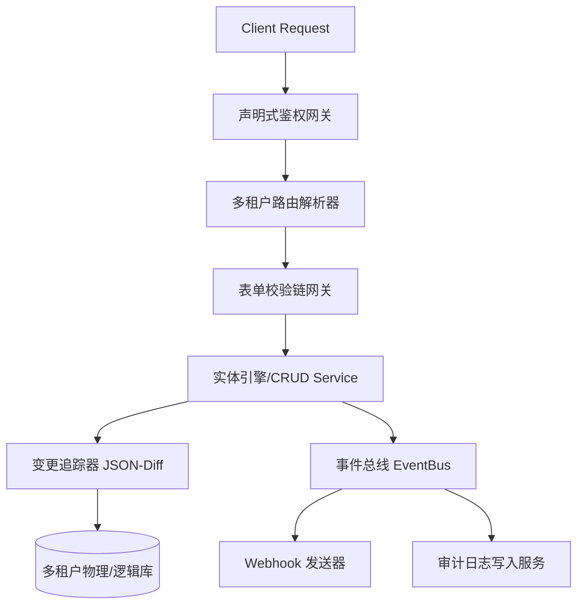

# NetYamlForge 核心框架底层功能进化详细设计书

本设计书旨在为低代码声明式驱动应用框架 **NetYamlForge** 提供底层核心基础设施的升级方案。设计针对框架在**身份鉴权、表单校验、审计追踪、事件 Webhook 及多租户隔离**五个维度的核心不足，制定了声明式、可插拔且具备高安全性的演进路径。

---

## 🛠️ 整体架构演进拓扑



---

## 1. 声明式身份认证与行级/字段级细粒度授权

### 1.1 现有缺陷分析
目前 [PagePermissionService.cs](file:///home/ubuntu/ws/NetYamlForge/NetYamlForge/Services/Auth/PagePermissionService.cs) 仅实现了粗粒度的页面和字段写权限控制，缺乏声明式的 API 路由保护、行级安全隔离（RLS）和自动脱敏/只读字段过滤机制。

### 1.2 升级设计方案

#### A. 实体声明式授权规范
在实体 YAML 配置文件（如 `entities.yaml`）中直接定义基于角色的 CRUD 权限和只读（Read-Only）、脱敏（Masking）配置：

```yaml
entity: customer_profile
table_name: customer_profiles
security:
  # 实体级访问控制
  permissions:
    read: ["User", "Manager", "Admin"]
    write: ["Manager", "Admin"]
    delete: ["Admin"]
  
  # 行级安全控制 (RLS - Row Level Security)
  row_level_security:
    enabled: true
    # 策略定义：User 角色只能访问自己创建的数据，Manager 及以上无限制
    policies:
      - role: "User"
        filter_clause: "created_by = @CurrentUser"
      - role: "Manager"
        filter_clause: "department_id = @UserDepartment"

fields:
  - name: id
    type: int
    editable: false
  - name: email
    type: string
    security:
      # 字段级保护
      read_mask: "email" # 脱敏策略，如 a***b@domain.com
      write_roles: ["Manager", "Admin"]
  - name: social_security_number
    type: string
    security:
      read_roles: ["Admin"] # 只有 Admin 才能读取该字段
      write_roles: ["Admin"]
```

#### B. 动态查询重写引擎 (SQL Rewrite Engine)
在 `FilterSqlBuilder.cs` 阶段引入 RLS 策略解析。当执行查询时：
1. 从当前上下文中解析 `IUserAuthService` 获取当前用户的角色和上下文信息（User ID, Department ID 等）。
2. 在组装 SQL 时，如果实体定义了 `row_level_security` 且当前角色匹配某条 Policy，则自动在 `WHERE` 条件中附加 `AND (filter_clause)`。
3. 通过参数化查询传入 `@CurrentUser` 等上下文变量，避免 SQL 注入风险。

#### C. 数据输出脱敏中间件 (Data Masking Middleware)
实现 `IDataMaskingService`，在 API 响应序列化前，根据用户的角色定义过滤实体输出。若用户不具备某字段的 `read_roles`，该字段会被设置为 `null` 或默认值；若存在 `read_mask` 规则，则自动应用字符串遮罩。

---

## 2. 动态表单验证与多维复杂约束引擎

### 2.1 现有缺陷分析
现有的 [FormValueValidationService.cs](file:///home/ubuntu/ws/NetYamlForge/NetYamlForge/Services/FormValueValidationService.cs) 只封装了 Dapper 字段类型的基础强转和 `Required` 验证，不支持正则表达式、数值范围、多字段联动条件校验及自定义 Hook 深度校验。

### 2.2 升级设计方案

#### A. 声明式规则链配置
在实体 YAML 属性中扩充 `validators` 验证链：

```yaml
fields:
  - name: age
    type: int
    validators:
      - type: range
        min: 18
        max: 120
        error_message: "年龄必须在 18 至 120 岁之间"
  - name: contact_phone
    type: string
    validators:
      - type: regex
        pattern: "^\\+?[0-9]{7,15}$"
        error_message: "电话号码格式不正确"
  - name: internal_rating
    type: int
    validators:
      # 条件联动校验：仅当 status 为 'Active' 时，internal_rating 为必填
      - type: required_if
        condition: "status == 'Active'"
        error_message: "激活状态下必须填写内部评级"
      # Hook 校验：调用 Roslyn 动态钩子进行第三方系统的实时信用评级检验
      - type: custom_hook
        hook_name: "ValidateCreditRating"
```

#### B. 验证管道设计模式 (Validator Pipeline)
重构 `FormValueValidationService`，引入可拓展的 `IValidator` 接口体系：

```csharp
public interface IFieldValidator
{
    string ValidatorType { get; }
    ValidationResult Validate(object? value, Dictionary<string, object?> rowContext, JsonElement validatorConfig);
}
```

- **内置校验器**：
  - `RegexFieldValidator`：用于正则匹配。
  - `RangeFieldValidator`：用于数值/日期范围比对。
  - `ConditionalFieldValidator`：利用简易表达式解析器评估当前行上下文 `rowContext`（如 `status == 'Active'`），判断是否触发校验。
- **自定义编译钩子校验器**：
  - `HookFieldValidator`：自动路由至 `ProjectHookLoader` 加载的 Roslyn 脚本进行业务逻辑校验，例如调用外部 API 检查库存或客户信用度。

---

## 3. 精密变更追踪与结构化审计日志 (JSON Diff)

### 3.1 现有缺陷分析
现有的 [AuditLogService.cs](file:///home/ubuntu/ws/NetYamlForge/NetYamlForge/Services/Auth/AuditLogService.cs) 采用单表的非结构化 Detail 存储。缺乏对数据修改前后（Before/After）具体字段值变化对比的精密追踪能力，无法生成标准审计 Differential (Diff)。

### 3.2 升级设计方案

#### A. 数据库结构升级 (system.db)
扩展并迁移 `AuditLog` 表，新增结构化列：

```sql
CREATE TABLE AuditLog (
    Id INTEGER PRIMARY KEY AUTOINCREMENT,
    UserName TEXT NOT NULL,
    Action TEXT NOT NULL,          -- 'INSERT', 'UPDATE', 'DELETE', 'LOGIN', etc.
    Entity TEXT,                  -- 'customer_profile', 'book', etc.
    RecordId TEXT,                -- 受影响记录的主键 ID
    DiffData TEXT,                -- JSON 格式的变更对比数据 (Diff JSON)
    ClientIp TEXT,
    UserAgent TEXT,
    CreatedAt TEXT NOT NULL
);
```

#### B. JSON Diff 生成算法 (Entity State Tracker)
在写入变更（`RowMutationRepository.cs`）时自动捕获状态差异：
1. **UPDATE 操作**：
   - 执行前，使用物理 ID 查询数据库获取原值（Old Record）。
   - 将原值与提交的新值（New Record）进行字段级深比对（Deep Compare）。
   - 过滤掉未变更字段，仅保留差异并生成结构化 Diff 记录：
     ```json
     {
       "changed_fields": {
         "email": { "old": "user_old@test.com", "new": "user_new@test.com" },
         "status": { "old": "Pending", "new": "Active" }
       }
     }
     ```
2. **INSERT / DELETE 操作**：
   - INSERT 记录所有字段为 `"old": null`。
   - DELETE 记录所有字段为 `"new": null`。

#### C. 物理存储优化与敏感字段过滤
在生成 Diff 过程中，检测 `entities.yaml` 中标记为敏感的字段（如 `password_hash`, `ssn`），过滤掉其具体值对比，将 Diff 中的原值与新值修改为 `[REDACTED]`。

---

## 4. 通用 Webhooks 与高可用事件驱动引擎

### 4.1 现有缺陷分析
框架尚无发布数据或作业状态变更事件的机制，无法向外部微服务或协作平台进行事件派发。

### 4.2 升级设计方案

#### A. 事件总线设计 (EventBus & Event Envelope)
设计轻量级的进程内事件分发器，用于解耦业务逻辑与消息派发。定义标准事件信封（Event Envelope）：

```csharp
public record EventEnvelope(
    string EventId,
    string EventType,      -- "entity.created", "entity.updated", "batchjob.completed"
    string ProjectName,
    string EntityName,
    object Payload,        -- 包含实体数据或变更 Diff
    DateTime OccurredAt
);
```

#### B. 声明式 Webhook 注册规范
在项目配置文件 `webhooks.yaml` 中声明事件订阅机制：

```yaml
webhooks:
  - name: sync_to_crm
    events: ["entity.created", "entity.updated"]
    target_entity: "customer_profile"
    url: "https://api.crm.internal/v1/webhook"
    secret: "whsec_abc123" # 用于生成 HMAC-SHA256 签名，供接收端验签
    retry:
      max_attempts: 5
      initial_interval_seconds: 3
      backoff_multiplier: 2.0 # 指数退避策略
```

#### C. 带有重试机制的高可用发送器 (Webhook Dispatcher)
1. **可靠派发**：构建专用的 Webhook 队列服务。若发送失败，将该任务投递至后台任务队列中，依赖现有的 `BatchJob` 引擎重试机制进行处理。
2. **安全签名保障**：在 HTTP 请求头中带上 `X-NetYamlForge-Signature`。签名生成规则为：`HMACSHA256(PayloadJson, Secret)`。接收端通过该签名验证请求包体未被篡改，且来源于受信框架实例。

---

## 5. 多租户隔离与连接路由系统

### 5.1 现有缺陷分析
目前多数据库连接被硬性路由到 `system.db`（系统配置）以及特定项目的 SQLite/MySQL 实例上，未提供原生的多租户数据逻辑与物理隔离能力。

### 5.2 升级设计方案

#### A. 隔离策略支持
框架将支持两种模式的租户隔离，可在 `tenant.yaml` 中全局定义：
1. **共享数据库逻辑隔离 (Logical Isolation)**：通过表中的 `tenant_id` 列区分租户。
2. **独立数据库物理隔离 (Physical Isolation)**：每个租户拥有独立的物理数据库和连接字符串。

```yaml
multitenancy:
  strategy: "logical" # 'logical' or 'physical'
  tenant_resolver:
    source: "header"  # 解析来源：'header' (X-Tenant-ID), 'subdomain' or 'query'
    key: "X-Tenant-ID"
```

#### B. 租户上下文解析器 (TenantContextResolver)
实现 `TenantContextResolver` 中间件：
1. 从每次 HTTP 请求的 Header、子域名或 Query String 中提取 Tenant Key。
2. 验证租户合法性，将当前租户信息（ID, ConnectionString）注入至作用域生命周期的 `TenantContext` 中。

#### C. 动态连接路由 (Dynamic Connection Routing)
重构 `ConnectionManager.cs` 的 `GetConnectionAsync` 逻辑：
- **物理隔离模式**：若启用物理隔离，则直接使用 `TenantContext` 关联的连接字符串，建立对应租户的物理连接。
- **逻辑隔离模式**：若启用逻辑隔离，则在执行 Dynamic Entity CRUD 时，由 SQL 构建器拦截并强制追加 `tenant_id = @TenantId` 条件，同时在写入时自动将当前租户 ID 绑定到插入记录中。

---

## 📅 实现与重构里程碑

| 阶段 | 核心模块 | 改造涉及的关键类 | 预期产出 |
|---|---|---|---|
| **Phase 1** | **校验与鉴权网关升级** | [FormValueValidationService.cs](file:///home/ubuntu/ws/NetYamlForge/NetYamlForge/Services/FormValueValidationService.cs), [PagePermissionService.cs](file:///home/ubuntu/ws/NetYamlForge/NetYamlForge/Services/Auth/PagePermissionService.cs) | 支持验证链配置、行级过滤与敏感字段脱敏输出 |
| **Phase 2** | **变更追踪与精密审计** | [RowMutationRepository.cs](file:///home/ubuntu/ws/NetYamlForge/NetYamlForge/Services/RowMutationRepository.cs), [AuditLogService.cs](file:///home/ubuntu/ws/NetYamlForge/NetYamlForge/Services/Auth/AuditLogService.cs) | 实现基于 JSON-Diff 的精密数据修改历史审计表 |
| **Phase 3** | **Webhook 事件发布系统** | `WebhookDispatcher.cs`, `EventBus.cs` | 增加实体修改事件的 HMAC 签名 Webhook 回调推送功能 |
| **Phase 4** | **多租户切分与连接路由** | [ConnectionManager.cs](file:///home/ubuntu/ws/NetYamlForge/NetYamlForge/Services/Connection/ConnectionManager.cs) | 实现根据租户 ID 动态路由物理连接/动态注入过滤条件机制 |
