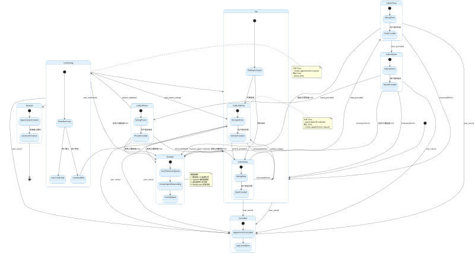

# 汽车销售系统 AI 接入扩展方案 - 补充材料

> **基于**: `docs/设计2.md` 改进建议  
> **创建日期**: 2026-04-09  
> **目标**: 补充钩子模板、ESCALATE 状态、SqlSafetyGuard 集成、热重载隔离机制

---

## 目录

- [一、IEntityHook 脱敏 + 审计日志实现模板](#一ientityhook-脱敏--审计日志实现模板)
- [二、FSM 状态流转图（含 ESCALATE 路径）](#二fsm-状态流转图含-escalate-路径)
- [三、SqlSafetyGuard 集成示例代码](#三sqlsafetyguard-集成示例代码)
- [四、热重载会话隔离机制](#四热重载会话隔离机制)

---

## 一、IEntityHook 脱敏 + 审计日志实现模板

### 1.1 PII 自动脱敏钩子

**文件位置**: `projects/auto-dealer-demo/Hooks/AiDataPrivacyHooks.cs`

```csharp
using System.Data;
using System.Text.RegularExpressions;
using NetYamlForge.Services.Hooks;

namespace AutoDealer.Hooks;

/// <summary>
/// AI 对话数据 PII 自动脱敏钩子
/// 
/// 功能：
/// 1. 手机号中间 4 位掩码（138****5678）
/// 2. 邮箱地址部分掩码（abc***@example.com）
/// 3. 身份证号部分掩码（110105****1234****）
/// 4. 姓名仅保留首字符（张**）
/// 
/// YAML 配置示例：
///   hooks:
///     beforeCreate: "ai_pii_mask"
///     beforeUpdate: "ai_pii_mask"
/// </summary>
public class AiPiiMaskHook : IEntityHook
{
    public string Name => "ai_pii_mask";

    public Task<HookResult> BeforeAsync(EntityHookContext ctx, IDbConnection db, IDbTransaction? tx)
    {
        // 手机号脱敏
        if (ctx.Values.TryGetValue("phone", out var phone) && phone is string phoneStr)
        {
            ctx.Values["phone"] = MaskPhone(phoneStr);
        }

        // 邮箱脱敏
        if (ctx.Values.TryGetValue("email", out var email) && email is string emailStr)
        {
            ctx.Values["email"] = MaskEmail(emailStr);
        }

        // 姓名脱敏
        if (ctx.Values.TryGetValue("customer_name", out var name) && name is string nameStr)
        {
            ctx.Values["customer_name"] = MaskName(nameStr);
        }

        // 标记已脱敏
        ctx.Data["pii_masked"] = true;
        ctx.Data["masked_at"] = DateTime.UtcNow.ToString("yyyy-MM-dd HH:mm:ss.fff");

        return Task.FromResult(HookResult.Continue());
    }

    public Task AfterAsync(EntityHookContext ctx, IDbConnection db, IDbTransaction? tx)
        => Task.CompletedTask;

    /// <summary>
    /// 手机号掩码：13812345678 → 138****5678
    /// </summary>
    private static string MaskPhone(string phone)
    {
        // 移除所有非数字字符
        var digits = Regex.Replace(phone, @"[^\d]", "");
        
        if (digits.Length == 11)
        {
            // 中国大陆手机号：保留前 3 位和后 4 位
            return $"{digits[..3]}****{digits[^4..]}";
        }
        else if (digits.Length >= 7)
        {
            // 其他格式：保留前 3 位和后 2 位
            var maskLen = Math.Max(2, digits.Length - 5);
            return $"{digits[..3]}{new string('*', maskLen)}{digits[^2..]}";
        }
        
        // 过短号码：全部掩码
        return new string('*', Math.Max(3, digits.Length));
    }

    /// <summary>
    /// 邮箱掩码：zhang@example.com → zha***@example.com
    /// </summary>
    private static string MaskEmail(string email)
    {
        var atIndex = email.IndexOf('@');
        if (atIndex <= 0) return email; // 无效邮箱，原样返回

        var localPart = email[..atIndex];
        var domain = email[atIndex..];

        if (localPart.Length <= 2)
        {
            // 短用户名：保留首字符
            return $"{localPart[0]}{new string('*', localPart.Length - 1)}{domain}";
        }
        
        // 长用户名：保留前 3 字符
        var keepLen = Math.Min(3, localPart.Length);
        return $"{localPart[..keepLen]}***{domain}";
    }

    /// <summary>
    /// 姓名掩码：张三丰 → 张**
    /// </summary>
    private static string MaskName(string name)
    {
        if (string.IsNullOrWhiteSpace(name)) return name;
        
        if (name.Length == 1)
        {
            return name; // 单字姓名不掩码
        }
        else if (name.Length == 2)
        {
            return $"{name[0]}*"; // 二字姓名掩码最后一位
        }
        else
        {
            // 三字及以上：保留首字符，其余掩码
            return $"{name[0]}{new string('*', name.Length - 1)}";
        }
    }
}
```

### 1.2 AI 对话审计日志钩子

```csharp
using System.Data;
using NetYamlForge.Services.Hooks;
using Microsoft.Extensions.Logging;

namespace AutoDealer.Hooks;

/// <summary>
/// AI 对话审计日志钩子
/// 
/// 功能：
/// 1. 记录 AI 对话的创建/更新操作到 audit_log 表
/// 2. 捕获意图识别结果、槽位收集状态、Tool 调用元数据
/// 3. 记录用户会话 ID、操作时间、AI 工具类型
/// 
/// YAML 配置示例：
///   hooks:
///     afterCreate: "ai_audit_log"
///     afterUpdate: "ai_audit_log"
/// </summary>
public class AiAuditLogHook : IEntityHook
{
    private readonly ILogger<AiAuditLogHook> _logger;

    public AiAuditLogHook(ILogger<AiAuditLogHook> logger)
    {
        _logger = logger;
    }

    public string Name => "ai_audit_log";

    public Task<HookResult> BeforeAsync(EntityHookContext ctx, IDbConnection db, IDbTransaction? tx)
        => Task.FromResult(HookResult.Continue());

    public async Task AfterAsync(EntityHookContext ctx, IDbConnection db, IDbTransaction? tx)
    {
        try
        {
            // 构建审计详情
            var detail = BuildAuditDetail(ctx);
            
            // 插入审计日志
            const string sql = @"
INSERT INTO audit_log (
    user_name, 
    action, 
    entity, 
    entity_id,
    detail, 
    ip_address,
    created_at
) VALUES (
    @UserName, 
    @Action, 
    @Entity, 
    @EntityId,
    @Detail,
    @IpAddress,
    @CreatedAt
)";

            var param = new
            {
                UserName = ctx.UserName ?? "ai_system",
                Action = ctx.Operation.ToString(),
                Entity = ctx.Entity,
                EntityId = ctx.Id?.ToString() ?? ctx.Values.GetValueOrDefault("conversation_id")?.ToString(),
                Detail = detail,
                IpAddress = ctx.Data.GetValueOrDefault("ip_address")?.ToString() ?? "N/A",
                CreatedAt = DateTime.UtcNow.ToString("yyyy-MM-dd HH:mm:ss.fff")
            };

            await db.ExecuteAsync(sql, param, tx);
            
            _logger.LogInformation(
                "[Hook:ai_audit_log] AI 对话审计记录 - {Entity} {Operation}, ID={Id}",
                ctx.Entity,
                ctx.Operation,
                param.EntityId);
        }
        catch (Exception ex)
        {
            // 审计失败不应阻断主流程，仅记录错误
            _logger.LogError(ex, "[Hook:ai_audit_log] 审计日志记录失败：{Entity} {Operation}", 
                ctx.Entity, 
                ctx.Operation);
        }
    }

    /// <summary>
    /// 构建审计详情 JSON 字符串
    /// </summary>
    private static string BuildAuditDetail(EntityHookContext ctx)
    {
        var details = new Dictionary<string, object?>
        {
            ["operation"] = ctx.Operation.ToString(),
            ["timestamp"] = DateTime.UtcNow.ToString("o"),
            ["user"] = ctx.UserName ?? "ai_system"
        };

        // 根据操作类型捕获关键数据
        if (ctx.Operation == CrudOperation.Create)
        {
            details["conversation_id"] = ctx.Values.GetValueOrDefault("conversation_id");
            details["intent"] = ctx.Values.GetValueOrDefault("detected_intent");
            details["ai_tool"] = ctx.Values.GetValueOrDefault("ai_tool_used");
            details["confidence"] = ctx.Values.GetValueOrDefault("last_confidence");
        }
        else if (ctx.Operation == CrudOperation.Update)
        {
            details["conversation_id"] = ctx.Id?.ToString();
            details["state_transition"] = ctx.Data.GetValueOrDefault("state_transition");
            details["slots_collected"] = ctx.Data.GetValueOrDefault("slots_snapshot");
            details["tool_calls_count"] = ctx.Data.GetValueOrDefault("tool_calls_count");
        }

        // 序列化（简化版，实际可使用 System.Text.Json）
        return string.Join(", ", details.Select(kv => $"{kv.Key}: {kv.Value}"));
    }
}
```

### 1.3 AI 线索自动评分钩子

```csharp
using System.Data;
using NetYamlForge.Services.Hooks;

namespace AutoDealer.Hooks;

/// <summary>
/// AI 对话后自动更新销售线索评分钩子
/// 
/// 功能：
/// 1. AI 对话完成后自动更新线索的 ai_touch_count
/// 2. 根据意图类型和情感分析调整 lead_score
/// 3. 记录首次/末次触达对话 ID
/// 
/// YAML 配置示例：
///   hooks:
///     afterCreate: "ai_lead_scoring"
/// </summary>
public class AiLeadScoringHook : IEntityHook
{
    public string Name => "ai_lead_scoring";

    public Task<HookResult> BeforeAsync(EntityHookContext ctx, IDbConnection db, IDbTransaction? tx)
        => Task.FromResult(HookResult.Continue());

    public async Task AfterAsync(EntityHookContext ctx, IDbConnection db, IDbTransaction? tx)
    {
        try
        {
            // 获取关联的线索 ID（从 ctx.Data 或 ctx.Values）
            var leadId = ctx.Data.GetValueOrDefault("related_lead_id")?.ToString();
            if (string.IsNullOrEmpty(leadId) || !int.TryParse(leadId, out var leadIdInt))
            {
                return; // 无关联线索，跳过
            }

            // 计算评分增量
            var scoreDelta = CalculateScoreDelta(ctx);
            var touchCount = ctx.Data.GetValueOrDefault("previous_touch_count") as int? ?? 0;

            // 更新线索表
            const string sql = @"
UPDATE sales_leads 
SET 
    ai_touch_count = COALESCE(ai_touch_count, 0) + 1,
    lead_score = MIN(100, MAX(0, COALESCE(lead_score, 50) + @ScoreDelta)),
    ai_last_touch_conversation_id = @ConversationId,
    ai_first_touch_conversation_id = COALESCE(ai_first_touch_conversation_id, @ConversationId),
    updated_at = @UpdatedAt
WHERE id = @LeadId";

            var param = new
            {
                ScoreDelta = scoreDelta,
                ConversationId = ctx.Id?.ToString() ?? ctx.Values.GetValueOrDefault("conversation_id"),
                UpdatedAt = DateTime.UtcNow.ToString("yyyy-MM-dd HH:mm:ss.fff"),
                LeadId = leadIdInt
            };

            await db.ExecuteAsync(sql, param, tx);
        }
        catch (Exception ex)
        {
            // 评分失败不阻断主流程
            // 实际项目中应记录到错误队列或重试队列
        }
    }

    /// <summary>
    /// 根据对话内容计算评分增量
    /// </summary>
    private static int CalculateScoreDelta(EntityHookContext ctx)
    {
        var delta = 0;

        // 意图评分
        var intent = ctx.Values.GetValueOrDefault("detected_intent")?.ToString();
        delta += intent switch
        {
            "test_drive_request" => 15,
            "price_inquiry" => 10,
            "vehicle_comparison" => 12,
            "finance_inquiry" => 8,
            "general_inquiry" => 3,
            _ => 0
        };

        // 情感分析加分
        if (ctx.Data.TryGetValue("sentiment_score", out var sentiment) && 
            double.TryParse(sentiment?.ToString(), out var score))
        {
            if (score > 0.7) delta += 5;  // 正面情感
            else if (score < 0.3) delta -= 3; // 负面情感
        }

        // 槽位完成度加分
        var slotsCount = ctx.Data.GetValueOrDefault("slots_filled") as int? ?? 0;
        if (slotsCount >= 5) delta += 10; // 信息收集完整

        return delta;
    }
}
```

### 1.4 YAML 配置示例

**文件位置**: `projects/auto-dealer-demo/entities/ai_conversations.yml`

```yaml
hooks:
  beforeCreate:
    - "ai_pii_mask"              # PII 自动脱敏
    - "validate_ai_conversation" # 数据验证（已有）
  
  afterCreate:
    - "ai_audit_log"             # 审计日志
    - "ai_lead_scoring"          # 线索自动评分
    - "set_conversation_timestamps" # 时间戳（已有）
  
  afterUpdate:
    - "ai_audit_log"
    - "update_conversation_updated_at" # 更新时间戳（已有）
```

---

## 二、FSM 状态流转图（含 ESCALATE 路径）

### 2.1 完整状态流转图（PlantUML）



### 2.2 状态机实现代码（含 ESCALATE）

**文件位置**: `NetYamlForge/Services/AI/AppointmentStateMachine.cs`（新建）

```csharp
using Stateless;
using Stateless.Graph;

namespace NetYamlForge.Services.AI;

/// <summary>
/// 试驾预约状态机
/// 
/// 状态流转：
/// Init → CollectVehicle → CollectDate → CollectTime → CollectName → CollectPhone → Confirming → Booked
/// 任意状态 → Escalate（连续 2 次置信度 < 0.6）
/// Escalate → Init（人工坐席接管后）
/// </summary>
public class AppointmentStateMachine
{
    // 状态定义
    public enum State
    {
        Init,
        CollectVehicle,
        CollectDate,
        CollectTime,
        CollectName,
        CollectPhone,
        Confirming,
        Booked,
        Cancelled,
        Escalate  // ⚠️ 新增：脱线状态
    }

    // 触发器定义
    public enum Trigger
    {
        VehicleProvided,
        DateProvided,
        TimeProvided,
        NameProvided,
        PhoneProvided,
        PhoneInvalid,
        Confirmed,
        Cancelled,
        Timeout,
        LowConfidence,      // ⚠️ 新增：低置信度
        HumanResolved       // ⚠️ 新增：人工坐席解决
    }

    private readonly StateMachine<State, Trigger> _machine;
    private readonly string _conversationId;
    private int _lowConfidenceCount = 0; // 连续低置信度计数

    public AppointmentStateMachine(string conversationId)
    {
        _conversationId = conversationId;
        _machine = new StateMachine<State, Trigger>(State.Init);

        ConfigureTransitions();
    }

    private void ConfigureTransitions()
    {
        // Init 状态转换
        _machine.Configure(State.Init)
            .OnEntry(() => _lowConfidenceCount = 0)
            .Permit(Trigger.VehicleProvided, State.CollectVehicle)
            .Permit(Trigger.DateProvided, State.CollectDate)
            .Permit(Trigger.Cancelled, State.Cancelled);

        // 信息收集状态链
        _machine.Configure(State.CollectVehicle)
            .Permit(Trigger.VehicleProvided, State.CollectDate)
            .Permit(Trigger.LowConfidence, HandleLowConfidence())
            .Permit(Trigger.Timeout, State.Init)
            .Permit(Trigger.Cancelled, State.Cancelled);

        _machine.Configure(State.CollectDate)
            .Permit(Trigger.DateProvided, State.CollectTime)
            .Permit(Trigger.LowConfidence, HandleLowConfidence())
            .Permit(Trigger.Timeout, State.Init)
            .Permit(Trigger.Cancelled, State.Cancelled);

        _machine.Configure(State.CollectTime)
            .Permit(Trigger.TimeProvided, State.CollectName)
            .Permit(Trigger.LowConfidence, HandleLowConfidence())
            .Permit(Trigger.Timeout, State.Init)
            .Permit(Trigger.Cancelled, State.Cancelled);

        _machine.Configure(State.CollectName)
            .Permit(Trigger.NameProvided, State.CollectPhone)
            .Permit(Trigger.LowConfidence, HandleLowConfidence())
            .Permit(Trigger.Timeout, State.Init)
            .Permit(Trigger.Cancelled, State.Cancelled);

        _machine.Configure(State.CollectPhone)
            .Permit(Trigger.PhoneProvided, State.Confirming)
            .Permit(Trigger.PhoneInvalid, State.CollectPhone) // 重新收集
            .Permit(Trigger.LowConfidence, HandleLowConfidence())
            .Permit(Trigger.Timeout, State.Init)
            .Permit(Trigger.Cancelled, State.Cancelled);

        // 确认状态
        _machine.Configure(State.Confirming)
            .Permit(Trigger.Confirmed, State.Booked)
            .Permit(Trigger.LowConfidence, HandleLowConfidence())
            .Permit(Trigger.Timeout, State.Init)
            .Permit(Trigger.Cancelled, State.Cancelled);

        // 终端状态
        _machine.Configure(State.Booked)
            .OnEntryAsync(async () => await OnAppointmentBookedAsync());

        _machine.Configure(State.Cancelled)
            .OnEntryAsync(async () => await OnAppointmentCancelledAsync());

        // ⚠️ ESCALATE 状态
        _machine.Configure(State.Escalate)
            .OnEntryFrom(Trigger.LowConfidence, async () => await OnEscalateAsync())
            .OnEntry(() => _lowConfidenceCount = 0) // 重置计数器
            .Permit(Trigger.HumanResolved, State.Init);
    }

    /// <summary>
    /// 处理低置信度：连续 2 次后触发 ESCALATE
    /// </summary>
    private State HandleLowConfidence()
    {
        _lowConfidenceCount++;
        
        if (_lowConfidenceCount >= 2)
        {
            return State.Escalate;
        }
        
        return _machine.State; // 保持当前状态
    }

    /// <summary>
    /// 触发 ESCALATE 状态
    /// </summary>
    public void TriggerLowConfidence(double confidence)
    {
        if (_machine.State is State.Escalate or State.Booked or State.Cancelled)
        {
            return; // 终端状态不触发
        }

        _machine.Fire(Trigger.LowConfidence);
    }

    /// <summary>
    /// 获取当前状态
    /// </summary>
    public State CurrentState => _machine.State;

    /// <summary>
    /// 获取当前状态允许的 Tool 列表
    /// </summary>
    public HashSet<string> GetAllowedTools()
    {
        return _machine.State switch
        {
            State.Init => new HashSet<string> { "query_data" },
            State.CollectVehicle => new HashSet<string> { "query_data" }, // 仅车辆查询
            State.CollectDate => new HashSet<string>(),
            State.CollectTime => new HashSet<string>(),
            State.CollectName => new HashSet<string>(),
            State.CollectPhone => new HashSet<string>(),
            State.Confirming => new HashSet<string> { "create_appointment_request" },
            State.Booked => new HashSet<string>(),
            State.Escalate => new HashSet<string>(), // 人工接管，禁止 AI Tool
            _ => new HashSet<string>()
        };
    }

    /// <summary>
    /// 检查 Tool 调用是否被当前状态允许
    /// </summary>
    public bool IsToolAllowed(string toolName)
    {
        var allowed = GetAllowedTools();
        
        // query_data 在 CollectVehicle 状态仅允许查询 vehicles
        if (_machine.State == State.CollectVehicle && toolName == "query_data")
        {
            return true; // 具体 entity 校验由 ToolCallValidator 处理
        }
        
        return allowed.Contains(toolName);
    }

    /// <summary>
    /// 生成状态图（PlantUML 格式）
    /// </summary>
    public string GenerateStateDiagram()
    {
        return UmlDotGraph.Format(_machine.GetGraph());
    }

    // ===== 事件处理器 =====

    private Task OnAppointmentBookedAsync()
    {
        // 发送确认通知、更新档期等
        return Task.CompletedTask;
    }

    private Task OnAppointmentCancelledAsync()
    {
        // 释放档期、记录日志等
        return Task.CompletedTask;
    }

    private async Task OnEscalateAsync()
    {
        // 1. 推送至人工坐席队列（通过 SignalR）
        // 2. 更新对话状态为 escalated
        // 3. 发送通知给客服团队
        await Task.CompletedTask;
    }
}
```

### 2.3 状态持久化

**数据库迁移脚本**: `projects/auto-dealer-demo/migrations/005_add_fsm_state.sql`

```sql
-- AI 对话表新增 FSM 状态字段
ALTER TABLE ai_conversations 
ADD COLUMN current_state TEXT DEFAULT 'init' 
CHECK(current_state IN ('init', 'collect_vehicle', 'collect_date', 'collect_time', 
                         'collect_name', 'collect_phone', 'confirming', 'booked', 
                         'cancelled', 'escalate'));

-- 新增已收集槽位字段（JSON 格式）
ALTER TABLE ai_conversations 
ADD COLUMN collected_slots TEXT;
-- 示例: {"vehicle":"RAV4","date":"2026-04-15","time":"10:00","name":"张三","phone":"138****5678"}

-- 新增连续低置信度计数
ALTER TABLE ai_conversations 
ADD COLUMN low_confidence_count INTEGER DEFAULT 0;

-- 新增人工坐席标记
ALTER TABLE ai_conversations 
ADD COLUMN escalated_to TEXT;
-- 示例: "agent_wang" 或 "queue_default"

-- 创建索引加速状态查询
CREATE INDEX idx_ai_conversations_state 
ON ai_conversations(current_state, updated_at);

-- 创建索引加速人工队列查询
CREATE INDEX idx_ai_conversations_escalated 
ON ai_conversations(escalated_to, current_state) 
WHERE current_state = 'escalate';
```

---

## 三、SqlSafetyGuard 集成示例代码

### 3.1 Tool 调用中的 SqlSafetyGuard 应用

**文件位置**: `NetYamlForge/Services/AI/ToolValidation/ToolCallValidator.cs`（新建）

```csharp
using System.Data;
using System.Text.Json.Nodes;
using JsonSchema.Net;
using NetYamlForge.Services;
using NetYamlForge.Services.Dialect;
using Microsoft.Extensions.Logging;

namespace NetYamlForge.Services.AI.ToolValidation;

/// <summary>
/// Tool 调用验证器
/// 
/// 三重安全网关：
/// 1. JSON Schema 结构校验
/// 2. Entity/Action 白名单校验
/// 3. SqlSafetyGuard 标识符过滤
/// </summary>
public class ToolCallValidator
{
    private readonly ILogger<ToolCallValidator> _logger;
    private readonly IEntityMetadataProvider _metadataProvider;
    private readonly IDialectService _dialectService;

    public ToolCallValidator(
        ILogger<ToolCallValidator> logger,
        IEntityMetadataProvider metadataProvider,
        IDialectService dialectService)
    {
        _logger = logger;
        _metadataProvider = metadataProvider;
        _dialectService = dialectService;
    }

    /// <summary>
    /// 验证 Tool 调用请求
    /// </summary>
    /// <param name="toolCall">LLM 输出的 Tool 调用 JSON</param>
    /// <param name="projectId">项目 ID</param>
    /// <returns>验证结果</returns>
    public async Task<ToolValidationResult> ValidateAsync(JsonNode toolCall, string projectId)
    {
        // [1] JSON Schema 校验
        var schemaResult = await ValidateSchemaAsync(toolCall);
        if (!schemaResult.IsValid)
        {
            return schemaResult;
        }

        // [2] Entity/Action 白名单校验
        var entityName = toolCall["entity"]?.ToString();
        var action = toolCall["action"]?.ToString();
        
        var entityResult = await ValidateEntityActionAsync(entityName, action, projectId);
        if (!entityResult.IsValid)
        {
            return entityResult;
        }

        // [3] SqlSafetyGuard 标识符过滤
        var safetyResult = ValidateSqlSafety(entityName, action, toolCall["filters"]);
        if (!safetyResult.IsValid)
        {
            return safetyResult;
        }

        return ToolValidationResult.Success();
    }

    /// <summary>
    /// [1] JSON Schema 校验
    /// </summary>
    private async Task<ToolValidationResult> ValidateSchemaAsync(JsonNode toolCall)
    {
        var toolName = toolCall["tool_call"]?.ToString();
        var schema = await LoadToolSchemaAsync(toolName);
        
        if (schema == null)
        {
            return ToolValidationResult.Fail($"Tool '{toolName}' 的 Schema 未找到");
        }

        var validationResult = schema.Validate(toolCall);
        if (!validationResult.IsValid)
        {
            var errors = string.Join("; ", validationResult.Errors.Select(e => e.Keyword));
            return ToolValidationResult.Fail($"JSON Schema 校验失败：{errors}");
        }

        return ToolValidationResult.Success();
    }

    /// <summary>
    /// [2] Entity/Action 白名单校验
    /// </summary>
    private async Task<ToolValidationResult> ValidateEntityActionAsync(
        string? entityName, 
        string? action, 
        string projectId)
    {
        if (string.IsNullOrEmpty(entityName))
        {
            return ToolValidationResult.Fail("entity 字段不能为空");
        }

        if (string.IsNullOrEmpty(action))
        {
            return ToolValidationResult.Fail("action 字段不能为空");
        }

        // 从项目元数据加载允许的实体列表
        var allowedEntities = await _metadataProvider.GetEntityNamesAsync(projectId);
        if (!allowedEntities.Contains(entityName, StringComparer.OrdinalIgnoreCase))
        {
            return ToolValidationResult.Fail(
                $"实体 '{entityName}' 不在项目 '{projectId}' 的白名单中。" +
                $"允许的实体：{string.Join(", ", allowedEntities)}");
        }

        // 验证 Action 是否合法
        var allowedActions = new[] { "list", "count", "get", "create", "update" };
        if (!allowedActions.Contains(action, StringComparer.OrdinalIgnoreCase))
        {
            return ToolValidationResult.Fail(
                $"操作 '{action}' 不允许。" +
                $"允许的操作：{string.Join(", ", allowedActions)}");
        }

        return ToolValidationResult.Success();
    }

    /// <summary>
    /// [3] SqlSafetyGuard 标识符过滤 ⚠️ 核心安全层
    /// </summary>
    private ToolValidationResult ValidateSqlSafety(
        string? entityName, 
        string? action, 
        JsonNode? filtersNode)
    {
        // 3.1 验证实体名（防止 SQL 注入表名）
        try
        {
            SqlSafetyGuard.EnsureIdentifier(entityName, "tool_call.entity");
        }
        catch (InvalidOperationException ex)
        {
            _logger.LogWarning(ex, "[SqlSafetyGuard] 实体名校验失败：{Entity}", entityName);
            return ToolValidationResult.Fail($"实体名包含不安全字符：{entityName}");
        }

        // 3.2 验证 Action（防止 SQL 注入操作）
        try
        {
            SqlSafetyGuard.EnsureIdentifier(action, "tool_call.action");
        }
        catch (InvalidOperationException ex)
        {
            _logger.LogWarning(ex, "[SqlSafetyGuard] Action 校验失败：{Action}", action);
            return ToolValidationResult.Fail($"操作名包含不安全字符：{action}");
        }

        // 3.3 验证过滤器字段（防止 SQL 注入列名）
        if (filtersNode is JsonArray filtersArray)
        {
            foreach (var filter in filtersArray)
            {
                if (filter is JsonObject filterObj && filterObj.TryGetPropertyValue("field", out var fieldNode))
                {
                    var fieldName = fieldNode?.ToString();
                    if (!string.IsNullOrEmpty(fieldName))
                    {
                        try
                        {
                            // ⚠️ 核心：使用 SqlSafetyGuard 验证列名
                            SqlSafetyGuard.EnsureIdentifier(fieldName, "tool_call.filter.field");
                        }
                        catch (InvalidOperationException ex)
                        {
                            _logger.LogWarning(ex, "[SqlSafetyGuard] 过滤器字段校验失败：{Field}", fieldName);
                            return ToolValidationResult.Fail($"过滤字段名包含不安全字符：{fieldName}");
                        }
                    }
                }

                // 验证排序字段
                if (filter is JsonObject filterObj2 && filterObj2.TryGetPropertyValue("orderBy", out var orderByNode))
                {
                    if (orderByNode is JsonObject orderByObj && orderByObj.TryGetPropertyValue("field", out var orderFieldNode))
                    {
                        var orderField = orderFieldNode?.ToString();
                        if (!string.IsNullOrEmpty(orderField))
                        {
                            try
                            {
                                // ⚠️ 核心：使用 SqlSafetyGuard 验证排序列名
                                SqlSafetyGuard.EnsureIdentifier(orderField, "tool_call.orderBy.field");
                            }
                            catch (InvalidOperationException ex)
                            {
                                _logger.LogWarning(ex, "[SqlSafetyGuard] 排序字段校验失败：{Field}", orderField);
                                return ToolValidationResult.Fail($"排序字段名包含不安全字符：{orderField}");
                            }
                        }
                    }
                }
            }
        }

        // 3.4 检测危险 SQL 标记
        var fullJson = toolCall?.ToJsonString();
        if (SqlSafetyGuard.IsUnsafeToken(fullJson))
        {
            _logger.LogWarning("[SqlSafetyGuard] 检测到潜在 SQL 注入标记");
            return ToolValidationResult.Fail("请求包含潜在的 SQL 注入攻击标记");
        }

        return ToolValidationResult.Success();
    }

    /// <summary>
    /// 加载 Tool Schema（从 skills/ 目录）
    /// </summary>
    private async Task<JsonSchema?> LoadToolSchemaAsync(string? toolName)
    {
        var schemaPath = Path.Combine(
            Directory.GetCurrentDirectory(),
            "skills",
            "auto-dealer",
            $"_schema-{toolName}.json");

        if (!File.Exists(schemaPath))
        {
            return null;
        }

        var json = await File.ReadAllTextAsync(schemaPath);
        return JsonSchema.Parse(json);
    }
}

/// <summary>
/// Tool 验证结果
/// </summary>
public class ToolValidationResult
{
    public bool IsValid { get; private set; }
    public string? ErrorMessage { get; private set; }

    public static ToolValidationResult Success() => new() { IsValid = true };

    public static ToolValidationResult Fail(string message) => 
        new() { IsValid = false, ErrorMessage = message };
}
```

### 3.2 DynamicEntityCommandService 中的 SqlSafetyGuard 应用

**文件位置**: `NetYamlForge/Services/DynamicEntity/DynamicEntityCommandService.cs`（现有文件片段）

```csharp
// 现有代码中已有的 SqlSafetyGuard 使用示例
// 此处展示如何在 AI Tool 调用场景中集成

public async Task<object> ExecuteToolCommandAsync(
    string entityName, 
    string action, 
    Dictionary<string, object?> parameters,
    string projectId)
{
    // ⚠️ 第一层：验证器校验
    var validation = await _toolValidator.ValidateAsync(
        BuildToolCallJson(entityName, action, parameters), 
        projectId);
    
    if (!validation.IsValid)
    {
        throw new InvalidOperationException($"Tool 调用验证失败：{validation.ErrorMessage}");
    }

    // ⚠️ 第二层：构建安全 SQL
    using var connection = _connectionFactory.CreateConnection(projectId);
    
    switch (action.ToLowerInvariant())
    {
        case "list":
            return await ExecuteSafeListAsync(connection, entityName, parameters);
        
        case "create":
            return await ExecuteSafeInsertAsync(connection, entityName, parameters);
        
        case "update":
            return await ExecuteSafeUpdateAsync(connection, entityName, parameters);
        
        default:
            throw new InvalidOperationException($"不支持的操作：{action}");
    }
}

/// <summary>
/// 安全列表查询（使用 SqlSafetyGuard）
/// </summary>
private async Task<List<Dictionary<string, object?>>> ExecuteSafeListAsync(
    IDbConnection connection,
    string entityName,
    Dictionary<string, object?> parameters)
{
    // 1. 验证表名
    SqlSafetyGuard.EnsureIdentifier(entityName, "ExecuteSafeListAsync.tableName");
    
    // 2. 构建参数化 SQL（不使用字符串插值）
    var sql = $"SELECT * FROM {entityName}";
    var conditions = new List<string>();
    var dbParams = new DynamicParameters();
    
    // 3. 安全处理过滤条件
    if (parameters.TryGetValue("filters", out var filters) && filters is List<Filter> filterList)
    {
        foreach (var filter in filterList)
        {
            // ⚠️ 核心：验证字段名
            SqlSafetyGuard.EnsureIdentifier(filter.Field, "filter.field");
            
            // 使用参数化查询
            var paramName = $"@p_{filter.Field}";
            conditions.Add($"{filter.Field} {GetOperator(filter.Op)} {paramName}");
            dbParams.Add(paramName, filter.Value);
        }
    }
    
    if (conditions.Count > 0)
    {
        sql += " WHERE " + string.Join(" AND ", conditions);
    }
    
    // 4. 安全处理排序
    if (parameters.TryGetValue("orderBy", out var orderBy) && orderBy is OrderBy order)
    {
        // ⚠️ 核心：验证排序字段名
        SqlSafetyGuard.EnsureIdentifier(order.Field, "orderBy.field");
        
        var dir = order.Direction.ToLowerInvariant() == "desc" ? "DESC" : "ASC";
        sql += $" ORDER BY {order.Field} {dir}";
    }
    
    // 5. 执行查询
    var result = await connection.QueryAsync(sql, dbParams);
    return result.ToList();
}
```

### 3.3 SqlSafetyGuard 测试用例

**文件位置**: `NetYamlForge.Tests/Services/AI/ToolValidation/SqlSafetyIntegrationTests.cs`（新建）

```csharp
using Xunit;
using NetYamlForge.Services;

namespace NetYamlForge.Tests.Services.AI.ToolValidation;

/// <summary>
/// SqlSafetyGuard 集成测试
/// </summary>
public class SqlSafetyIntegrationTests
{
    [Theory]
    [InlineData("vehicles", true)]
    [InlineData("sales_leads", true)]
    [InlineData("customers", true)]
    [InlineData("DROP TABLE customers;--", false)]
    [InlineData("customers; DROP TABLE", false)]
    public void EnsureIdentifier_ShouldValidateTableNames(string input, bool shouldPass)
    {
        if (shouldPass)
        {
            // 不应抛出异常
            SqlSafetyGuard.EnsureIdentifier(input, "test");
        }
        else
        {
            // 应抛出 InvalidOperationException
            var ex = Assert.Throws<InvalidOperationException>(
                () => SqlSafetyGuard.EnsureIdentifier(input, "test"));
            
            Assert.Contains("Unsafe identifier", ex.Message);
        }
    }

    [Theory]
    [InlineData("customer_name", true)]
    [InlineData("phone", true)]
    [InlineData("created_at", true)]
    [InlineData("column; DROP TABLE", false)]
    [InlineData("name' OR '1'='1", false)]
    public void EnsureIdentifier_ShouldValidateColumnNames(string input, bool shouldPass)
    {
        if (shouldPass)
        {
            SqlSafetyGuard.EnsureIdentifier(input, "test");
        }
        else
        {
            var ex = Assert.Throws<InvalidOperationException>(
                () => SqlSafetyGuard.EnsureIdentifier(input, "test"));
            
            Assert.Contains("Unsafe identifier", ex.Message);
        }
    }

    [Theory]
    [InlineData("list", true)]
    [InlineData("create", true)]
    [InlineData("DROP", false)]
    [InlineData("DELETE", false)]
    [InlineData("UPDATE; DROP", false)]
    public void EnsureIdentifier_ShouldValidateActions(string input, bool shouldPass)
    {
        if (shouldPass)
        {
            SqlSafetyGuard.EnsureIdentifier(input, "test");
        }
        else
        {
            Assert.Throws<InvalidOperationException>(
                () => SqlSafetyGuard.EnsureIdentifier(input, "test"));
        }
    }

    [Fact]
    public void IsUnsafeToken_ShouldDetectSqlInjectionMarkers()
    {
        Assert.True(SqlSafetyGuard.IsUnsafeToken("value; DROP TABLE"));
        Assert.True(SqlSafetyGuard.IsUnsafeToken("value--comment"));
        Assert.True(SqlSafetyGuard.IsUnsafeToken("value/*comment*/"));
        Assert.False(SqlSafetyGuard.IsUnsafeToken("normal_value"));
    }

    [Fact]
    public void EnsureExpression_ShouldRejectDangerousKeywords()
    {
        var dangerousKeywords = new[]
        {
            "DROP ", "ALTER ", "TRUNCATE ", "DELETE ", "INSERT ", 
            "UPDATE ", "EXEC ", "CREATE ", "UNION "
        };

        foreach (var keyword in dangerousKeywords)
        {
            var ex = Assert.Throws<InvalidOperationException>(
                () => SqlSafetyGuard.EnsureExpression($"column = {keyword}TABLE", "test"));
            
            Assert.Contains("forbidden keyword", ex.Message);
        }
    }
}
```

---

## 四、热重载会话隔离机制

### 4.1 核心设计原则

**目标**: YAML 配置热更新时不中断进行中的 AI 对话会话

**原则**:
1. **版本路由基于 SessionId 哈希**：新会话按 SessionId 哈希分配新版本，旧会话保持内存隔离
2. **热重载仅更新内存缓存**：不中断进行中会话
3. **会话级配置快照**：会话创建时捕获当前 Prompt 版本和 Tool 定义

### 4.2 实现方案

**文件位置**: `NetYamlForge/Services/HotReload/PromptVersionResolver.cs`（新建）

```csharp
using System.Security.Cryptography;
using System.Text;
using Microsoft.Extensions.Options;
using NetYamlForge.Services.AI;

namespace NetYamlForge.Services.HotReload;

/// <summary>
/// Prompt 版本解析器
/// 
/// 功能：
/// 1. 基于 SessionId 哈希分配 Prompt 版本
/// 2. 支持 AB 测试流量分配
/// 3. 会话级配置快照隔离
/// </summary>
public class PromptVersionResolver
{
    private readonly PromptHotReloadOptions _options;
    private readonly ILogger<PromptVersionResolver> _logger;

    // 会话级版本缓存（会话生命周期内不变）
    private readonly ConcurrentDictionary<string, string> _sessionVersions = new();

    public PromptVersionResolver(
        IOptions<PromptHotReloadOptions> options,
        ILogger<PromptVersionResolver> logger)
    {
        _options = options.Value;
        _logger = logger;
    }

    /// <summary>
    /// 解析会话应使用的 Prompt 版本
    /// </summary>
    /// <param name="sessionId">会话 ID</param>
    /// <returns>Prompt 版本路径（如 "v1", "v2"）</returns>
    public string ResolveVersion(string sessionId)
    {
        // 会话级缓存：确保同一会话始终使用同一版本
        if (_sessionVersions.TryGetValue(sessionId, out var version))
        {
            return version;
        }

        // AB 测试流量分配
        if (_options.AbTest.Enabled)
        {
            version = AssignAbTestVersion(sessionId);
        }
        else
        {
            // 默认使用当前版本
            version = _options.CurrentVersion;
        }

        // 缓存会话版本
        _sessionVersions.TryAdd(sessionId, version);

        _logger.LogInformation(
            "[PromptVersionResolver] 会话 {SessionId} 分配版本 {Version}",
            sessionId,
            version);

        return version;
    }

    /// <summary>
    /// AB 测试版本分配
    /// </summary>
    private string AssignAbTestVersion(string sessionId)
    {
        // 基于 SessionId 哈希分配
        var hash = ComputeSessionHash(sessionId);
        var ratio = hash % 100;

        return ratio < _options.AbTest.TrafficSplit
            ? _options.AbTest.VariantB
            : _options.AbTest.VariantA;
    }

    /// <summary>
    /// 计算会话哈希（0-99）
    /// </summary>
    private static uint ComputeSessionHash(string sessionId)
    {
        var hashBytes = SHA256.HashData(Encoding.UTF8.GetBytes(sessionId));
        return BitConverter.ToUInt32(hashBytes, 0) % 100;
    }

    /// <summary>
    /// 会话结束时清理版本缓存
    /// </summary>
    public void ClearSessionVersion(string sessionId)
    {
        _sessionVersions.TryRemove(sessionId, out _);
    }
}

/// <summary>
/// Prompt 热重载配置
/// </summary>
public class PromptHotReloadOptions
{
    public const string SectionName = "AI:Prompt";
    
    /// <summary>
    /// 当前 Prompt 版本
    /// </summary>
    public string CurrentVersion { get; set; } = "v1";

    /// <summary>
    /// 是否允许热重载
    /// </summary>
    public bool AllowHotReload { get; set; } = true;

    /// <summary>
    /// 防抖延迟（毫秒）
    /// </summary>
    public int ReloadDebounceMs { get; set; } = 500;

    /// <summary>
    /// AB 测试配置
    /// </summary>
    public AbTestOptions AbTest { get; set; } = new();
}

/// <summary>
/// AB 测试配置
/// </summary>
public class AbTestOptions
{
    /// <summary>
    /// 是否启用 AB 测试
    /// </summary>
    public bool Enabled { get; set; } = false;

    /// <summary>
    /// 变体 A 版本
    /// </summary>
    public string VariantA { get; set; } = "v1";

    /// <summary>
    /// 变体 B 版本
    /// </summary>
    public string VariantB { get; set; } = "v2";

    /// <summary>
    /// 变体 B 流量比例（0-100）
    /// </summary>
    public int TrafficSplit { get; set; } = 50;
}
```

### 4.3 会话级配置快照

**文件位置**: `NetYamlForge/Services/AI/SessionConfigSnapshot.cs`（新建）

```csharp
namespace NetYamlForge.Services.AI;

/// <summary>
/// 会话级配置快照
/// 
/// 功能：
/// 1. 会话创建时捕获当前 Prompt 版本、Tool 定义、系统提示词
/// 2. 会话生命周期内配置不变，避免热重载中断
/// 3. 会话结束时快照自动释放
/// </summary>
public class SessionConfigSnapshot : IDisposable
{
    private readonly string _sessionId;
    private readonly string _promptVersion;
    private readonly string _systemPrompt;
    private readonly Dictionary<string, object> _toolDefinitions;
    private readonly DateTime _capturedAt;
    private bool _disposed;

    public SessionConfigSnapshot(
        string sessionId,
        string promptVersion,
        string systemPrompt,
        Dictionary<string, object> toolDefinitions)
    {
        _sessionId = sessionId;
        _promptVersion = promptVersion;
        _systemPrompt = systemPrompt;
        _toolDefinitions = toolDefinitions;
        _capturedAt = DateTime.UtcNow;
    }

    public string SessionId => _sessionId;
    public string PromptVersion => _promptVersion;
    public string SystemPrompt => _systemPrompt;
    public IReadOnlyDictionary<string, object> ToolDefinitions => _toolDefinitions;
    public DateTime CapturedAt => _capturedAt;

    /// <summary>
    /// 获取系统提示词（会话生命周期内不变）
    /// </summary>
    public string GetSystemPrompt() => _systemPrompt;

    /// <summary>
    /// 获取 Tool 定义（会话生命周期内不变）
    /// </summary>
    public object? GetToolDefinition(string toolName)
    {
        return _toolDefinitions.TryGetValue(toolName, out var def) ? def : null;
    }

    public void Dispose()
    {
        if (_disposed) return;
        
        // 清理资源（如有）
        _toolDefinitions.Clear();
        _disposed = true;
        GC.SuppressFinalize(this);
    }
}
```

### 4.4 YamlHotReloadService 改造（支持会话隔离）

**文件位置**: `NetYamlForge/Services/HotReload/YamlHotReloadService.cs`（扩展现有代码）

```csharp
// 现有代码保持不变，仅添加新功能

public class YamlHotReloadService : IHostedService, IDisposable
{
    // ... 现有字段 ...
    
    private readonly PromptVersionResolver _promptVersionResolver;
    private readonly ActiveSessionTracker _sessionTracker;

    public YamlHotReloadService(
        // ... 现有参数 ...
        PromptVersionResolver promptVersionResolver,
        ActiveSessionTracker sessionTracker)
    {
        // ... 现有赋值 ...
        _promptVersionResolver = promptVersionResolver;
        _sessionTracker = sessionTracker;
    }

    private async Task ReloadAffectedCacheAsync(YamlFileChangedEventArgs e)
    {
        var filePath = e.FilePath;
        var projectName = e.ProjectName;

        // ... 现有重载逻辑 ...

        // ⚠️ 新增：通知活跃会话配置已更新（不中断会话）
        if (filePath.Contains("/skills/", StringComparison.OrdinalIgnoreCase) ||
            filePath.Contains("/_system-prompt", StringComparison.OrdinalIgnoreCase) ||
            filePath.Contains("/_tools-definition", StringComparison.OrdinalIgnoreCase))
        {
            await NotifyActiveSessionsAsync(projectName);
        }
    }

    /// <summary>
    /// 通知活跃会话配置已更新（通过 SignalR）
    /// </summary>
    private async Task NotifyActiveSessionsAsync(string projectName)
    {
        var sessions = _sessionTracker.GetActiveSessions(projectName);
        
        foreach (var session in sessions)
        {
            // 不中断会话：仅标记配置可更新（下次请求时生效）
            session.ConfigOutdated = true;
            
            // 通过 SignalR 推送通知
            await _signalRHub.Clients.User(session.UserId).SendAsync(
                "ConfigUpdated", 
                new { 
                    ProjectName = projectName, 
                    Message = "配置已更新，下次对话将使用新版本",
                    RequiresAction = false // 不需要用户操作
                });
        }

        _logger.LogInformation(
            "[YamlHotReloadService] 已通知 {Count} 个活跃会话配置更新",
            sessions.Count);
    }
}

/// <summary>
/// 活跃会话跟踪器
/// </summary>
public class ActiveSessionTracker
{
    private readonly ConcurrentDictionary<string, SessionInfo> _sessions = new();

    public void RegisterSession(string sessionId, SessionInfo info)
    {
        _sessions.TryAdd(sessionId, info);
    }

    public void UnregisterSession(string sessionId)
    {
        _sessions.TryRemove(sessionId, out _);
    }

    public List<SessionInfo> GetActiveSessions(string projectName)
    {
        return _sessions.Values
            .Where(s => s.ProjectName == projectName && s.IsActive)
            .ToList();
    }
}

public class SessionInfo
{
    public string SessionId { get; set; } = default!;
    public string ProjectName { get; set; } = default!;
    public string UserId { get; set; } = default!;
    public bool IsActive { get; set; } = true;
    public bool ConfigOutdated { get; set; } = false;
    public DateTime LastActivityAt { get; set; } = DateTime.UtcNow;
}
```

### 4.5 AutoDealerChatService 中的会话隔离使用

**文件位置**: `NetYamlForge/Services/AI/AutoDealerChatService.cs`（扩展现有代码）

```csharp
public class AutoDealerChatService
{
    private readonly PromptVersionResolver _promptVersionResolver;
    private readonly SkillLoader _skillLoader;

    public AutoDealerChatService(
        // ... 现有参数 ...
        PromptVersionResolver promptVersionResolver,
        SkillLoader skillLoader)
    {
        // ... 现有赋值 ...
        _promptVersionResolver = promptVersionResolver;
        _skillLoader = skillLoader;
    }

    /// <summary>
    /// 创建新会话时捕获配置快照
    /// </summary>
    public async Task<Conversation> CreateConversationAsync(string projectId, string userId)
    {
        // 1. 生成会话 ID
        var sessionId = Guid.NewGuid().ToString("N");

        // 2. 解析 Prompt 版本（基于 SessionId 哈希）
        var promptVersion = _promptVersionResolver.ResolveVersion(sessionId);

        // 3. 加载对应版本的系统提示词
        var systemPromptPath = $"skills/auto-dealer/{promptVersion}/_system-prompt-customer.md";
        var systemPrompt = await _skillLoader.LoadPromptAsync(systemPromptPath);

        // 4. 加载 Tool 定义
        var toolDefsPath = $"skills/auto-dealer/{promptVersion}/_tools-definition.md";
        var toolDefs = await _skillLoader.LoadToolDefinitionsAsync(toolDefsPath);

        // 5. 创建会话级配置快照
        var configSnapshot = new SessionConfigSnapshot(
            sessionId,
            promptVersion,
            systemPrompt,
            toolDefs);

        // 6. 创建对话记录
        var conversation = new Conversation
        {
            ConversationId = sessionId,
            ProjectId = projectId,
            UserId = userId,
            PromptVersion = promptVersion,
            ConfigSnapshot = configSnapshot,
            CreatedAt = DateTime.UtcNow
        };

        // 7. 注册到活跃会话跟踪器
        _sessionTracker.RegisterSession(sessionId, new SessionInfo
        {
            SessionId = sessionId,
            ProjectName = projectId,
            UserId = userId,
            IsActive = true
        });

        return conversation;
    }

    /// <summary>
    /// 处理用户消息时使用会话级配置
    /// </summary>
    public async Task<ChatResponse> ProcessMessageAsync(
        string sessionId, 
        string userMessage,
        CancellationToken ct)
    {
        // 1. 获取会话
        var conversation = await _conversationManager.GetConversationAsync(sessionId);
        
        // 2. 使用会话级配置快照（不受热重载影响）
        var configSnapshot = conversation.ConfigSnapshot;
        var systemPrompt = configSnapshot.GetSystemPrompt();
        var toolDefs = configSnapshot.ToolDefinitions;

        // 3. 检查配置是否过期（热重载通知）
        if (conversation.ConfigOutdated)
        {
            // 可选：提示用户配置已更新，下次生效
            // 或立即切换到新版本（需要迁移逻辑）
            _logger.LogInformation(
                "[AutoDealerChatService] 会话 {SessionId} 配置已过期，继续使用旧版本",
                sessionId);
        }

        // 4. 正常处理消息...
        var response = await _llmProvider.ChatAsync(
            systemPrompt,
            userMessage,
            toolDefs,
            ct);

        return BuildChatResponse(response, configSnapshot.PromptVersion);
    }

    /// <summary>
    /// 会话结束时清理
    /// </summary>
    public async Task CloseConversationAsync(string sessionId)
    {
        // 1. 清理会话
        await _conversationManager.CloseConversationAsync(sessionId);

        // 2. 注销活跃会话
        _sessionTracker.UnregisterSession(sessionId);

        // 3. 清理版本解析器缓存
        _promptVersionResolver.ClearSessionVersion(sessionId);
    }
}
```

### 4.6 appsettings.json 配置

```json
{
  "AI": {
    "Prompt": {
      "CurrentVersion": "v1",
      "AllowHotReload": true,
      "ReloadDebounceMs": 500,
      "AbTest": {
        "Enabled": false,
        "VariantA": "v1",
        "VariantB": "v2",
        "TrafficSplit": 50
      }
    }
  },
  "HotReload": {
    "Enabled": true,
    "OnlyInDevelopment": true,
    "DebounceMs": 500
  }
}
```

### 4.7 Prompt 目录结构

```
skills/auto-dealer/
├── v1/
│   ├── _system-prompt-customer.md    # 客户版系统提示词 v1
│   ├── _system-prompt-staff.md       # 员工版系统提示词 v1
│   └── _tools-definition.md          # Tool 定义 v1
├── v2/
│   ├── _system-prompt-customer.md    # 客户版系统提示词 v2
│   ├── _system-prompt-staff.md       # 员工版系统提示词 v2
│   └── _tools-definition.md          # Tool 定义 v2
└── current -> v1                      # 符号链接（可选）
```

---

## 五、总结与实施优先级

### 5.1 立即实施（堵死数据脏写）

| 优先级 | 任务 | 文件 | 预估工时 |
|--------|------|------|---------|
| 🔴 P0 | ToolCallValidator + SqlSafetyGuard | `ToolValidation/ToolCallValidator.cs` | 3h |
| 🔴 P0 | FSM 状态机 + ESCALATE 路径 | `AppointmentStateMachine.cs` | 2h |
| 🔴 P0 | PII 脱敏钩子 | `AiDataPrivacyHooks.cs` | 1h |

### 5.2 同步推进（保系统稳定）

| 优先级 | 任务 | 文件 | 预估工时 |
|--------|------|------|---------|
| 🟡 P1 | 审计日志钩子 | `AiAuditLogHook.cs` | 1h |
| 🟡 P1 | 线索评分钩子 | `AiLeadScoringHook.cs` | 1h |
| 🟡 P1 | 会话配置快照 | `SessionConfigSnapshot.cs` | 2h |

### 5.3 按需扩展（提升体验）

| 优先级 | 任务 | 文件 | 预估工时 |
|--------|------|------|---------|
| 🟢 P2 | Prompt 版本解析器 | `PromptVersionResolver.cs` | 1.5h |
| 🟢 P2 | 活跃会话跟踪器 | `ActiveSessionTracker.cs` | 1h |
| 🟢 P2 | SignalR 配置更新通知 | `YamlHotReloadService.cs` 扩展 | 1.5h |

---

## 六、参考文档

| 文档 | 说明 |
|------|------|
| `docs/设计1.md` | 企业级架构设计原版 |
| `docs/设计2.md` | 改进建议（本补充文档的来源） |
| `Services/Hooks/IEntityHook.cs` | 钩子接口定义 |
| `Services/Hooks/CommonHooks.cs` | 通用钩子实现参考 |
| `Services/SqlSafetyGuard.cs` | SQL 安全防护工具类 |
| `Services/HotReload/YamlHotReloadService.cs` | YAML 热重载服务 |
| [Stateless 文档](https://github.com/dotnet-state-machine/stateless) | .NET 状态机库 |

---

*文档版本: 1.1 | 创建: 2026-04-09 | 更新: 2026-04-09*  
*补充内容：IEntityHook 模板、ESCALATE 状态、SqlSafetyGuard 集成、热重载隔离*
